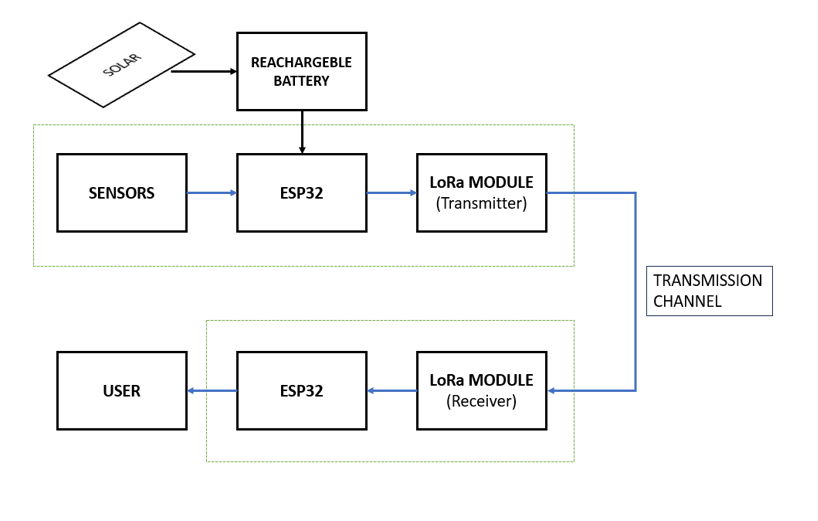
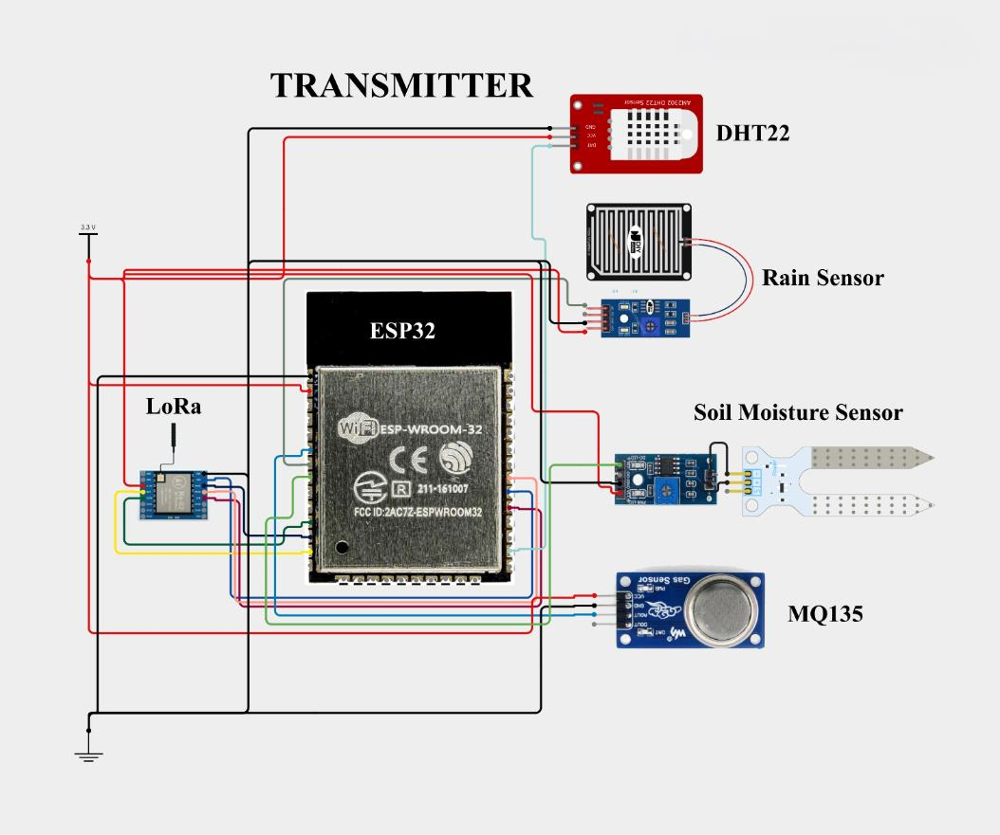
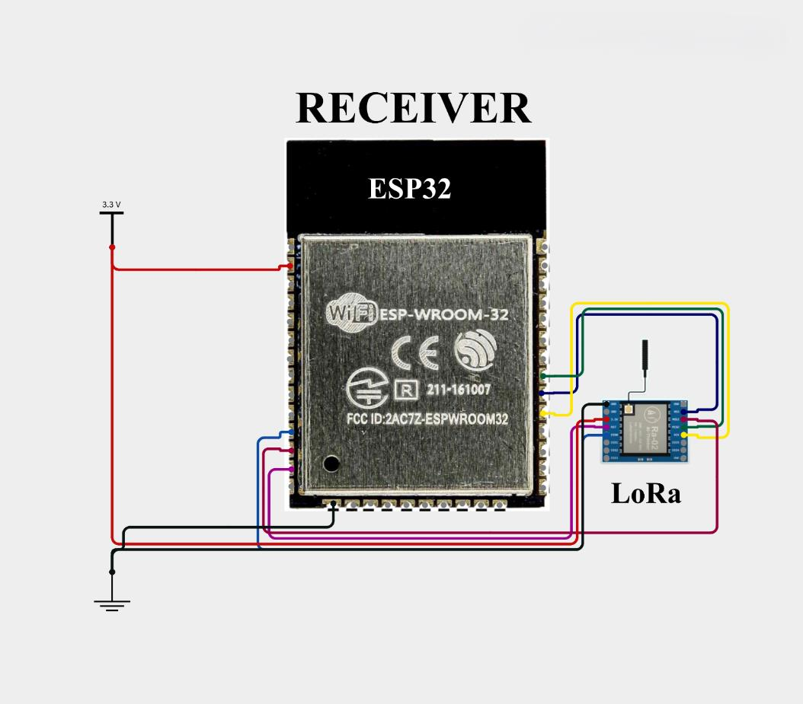
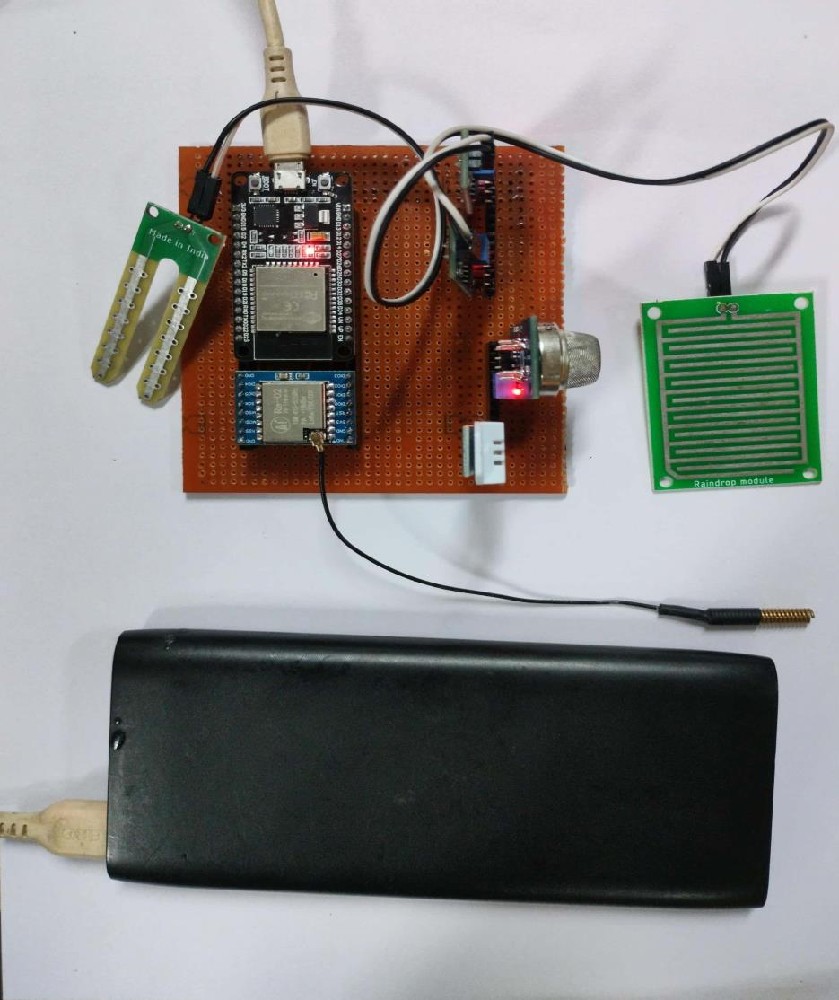
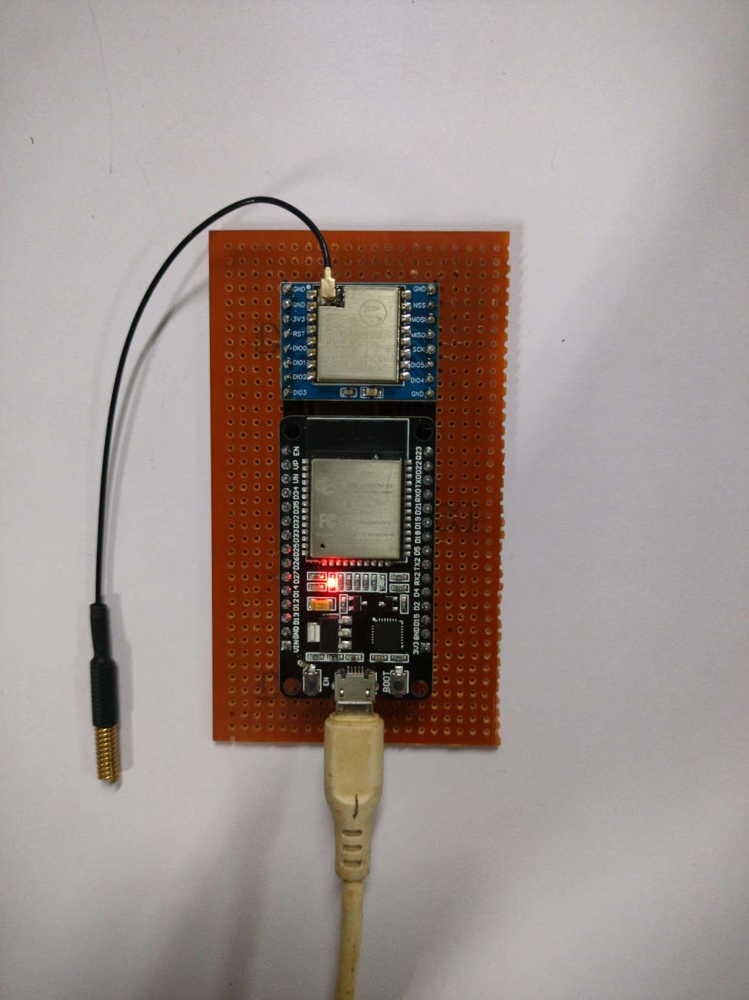

# Self-Powered IoT Weather Monitoring Station Using LoRa

A solar-powered environmental monitoring system built with ESP32 and LoRa (RA-02) that collects real-time weather data and logs it to Google Sheets via a cloud integration.

**Developed by:** Ananthakrishnan P, Arun Ramesh, Deepak M K, Geethanjali V  

---

## Overview

The system consists of a **Transmitter** node (sensor station) and a **Receiver** node (gateway). Environmental data is collected by the transmitter, sent over LoRa at 433 MHz, received by the gateway, and uploaded to Google Sheets in real time via Wi-Fi.

### Sensors
| Sensor | Parameter | Interface |
|--------|-----------|-----------|
| DHT22 | Temperature & Humidity | Digital (1-wire) |
| MQ135 | Air Quality (CO, CO₂, NH₃) | Analog |
| Rain Sensor | Precipitation | Digital + Analog |
| Soil Moisture | Soil Water Content | Analog |

---

## System Block Diagram



---

## Circuit Diagrams

### Transmitter


### Receiver


### Pin Connections

**LoRa RA-02 → ESP32 (both Transmitter and Receiver)**
| LoRa Pin | ESP32 GPIO |
|----------|-----------|
| NSS | GPIO 18 |
| RESET | GPIO 14 |
| DIO0 | GPIO 26 |
| SCK | GPIO 5 |
| MISO | GPIO 19 |
| MOSI | GPIO 27 |

**Sensors → Transmitter ESP32**
| Sensor | ESP32 GPIO |
|--------|-----------|
| DHT22 | GPIO 4 |
| MQ135 | GPIO 33 (ADC) |
| Rain Sensor | GPIO 35 (Digital) |
| Soil Moisture | GPIO 32 (ADC) |

---

## Implemented Hardware

### Transmitter


### Receiver


---

## Repository Structure

```
├── Transmitter.ino   # ESP32 firmware for the sensor node
├── Receiver.ino      # ESP32 firmware for the gateway node
└── README.md
```

---


## Setup & Usage

### Prerequisites

Install the following Arduino libraries:
- [LoRa by Sandeep Mistry](https://github.com/sandeepmistry/arduino-LoRa)
- [DHT sensor library by Adafruit](https://github.com/adafruit/DHT-sensor-library)
- [MQUnifiedsensor](https://github.com/miguel5612/MQSensorsLib)

### Transmitter Setup
1. Flash `Transmitter.ino` to the transmitter ESP32.
2. No Wi-Fi credentials needed — it only reads sensors and transmits over LoRa.

### Receiver Setup
1. Open `Receiver.ino` and update your Wi-Fi credentials:
   ```cpp
   const char* ssid = "YOUR_SSID";
   const char* password = "YOUR_PASSWORD";
   ```
2. Deploy a Google Apps Script as a web app and paste its script ID:
   ```cpp
   const String GOOGLE_SCRIPT_ID = "YOUR_SCRIPT_ID";
   ```
3. Flash to the receiver ESP32.

### How It Works
1. The transmitter reads all sensors every 5 seconds and sends a CSV-style string over LoRa:
   ```
   temp:29.40,hum:62.40,rain:Not_Raining,soil:0,CO:0,CO2:0,NH4:1,air:4095
   ```
2. The receiver parses the packet and makes an HTTP GET request to the Google Apps Script URL.
3. Data is logged to Google Sheets with a timestamp for live monitoring.

---

## Results

- LoRa range achieved: up to **2 km** in open areas
- Sensor data updated to Google Sheets every **~5 seconds**
- Total system cost under **₹2,200**

---

## Future Work

- Full solar charging integration with power management IC
- Additional sensors: wind speed, barometric pressure, UV index
- Predictive analytics using machine learning
- LoRa mesh networking for wider area coverage
- Dedicated mobile/web dashboard

---

## License

This project was developed as an academic mini-project. Feel free to use or adapt it for educational purposes.
